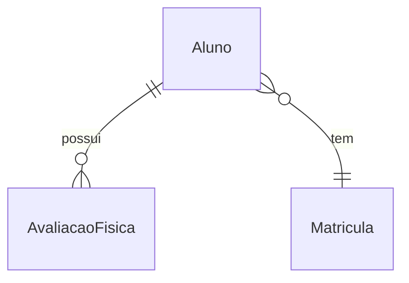

# Projeto Academia

Este projeto tem como objetivo gerenciar informações de uma academia através de três entidades principais: "Aluno", "Avaliação Física" e "Matrícula". Cada aluno pode ter N avaliações físicas e cada matrícula está relacionada a apenas 1 aluno.

## Tecnologias

O projeto foi desenvolvido utilizando o framework Spring Data e a linguagem Java. Além disso, foram utilizadas as seguintes ferramentas e bibliotecas:

* Lombok: para geração automática de getters, setters, construtores e outros métodos padrões
* Hibernate: para mapeamento objeto-relacional (ORM);
* Spring Boot: para facilitar a criação de aplicações Java;
* H2: um banco de dados relacional em memória para testes.

## Entidades

### Aluno
O aluno é a entidade principal do sistema e possui as seguintes informações:

* id: identificador único do aluno;
* nome: nome do aluno;
* dataDeNascimento: data de nascimento do aluno;
* email: e-mail do aluno;
* telefone: telefone do aluno;
* altura: altura do aluno;
* peso: peso do aluno;
* avaliacoesFisicas: lista de avaliações físicas realizadas pelo aluno.

### Avaliação Física

A avaliação física é uma entidade que representa uma avaliação realizada em um aluno. Possui as seguintes informações:

* id: identificador único da avaliação física;
* data: data em que a avaliação foi realizada;
* peso: peso do aluno na data da avaliação;
* altura: altura do aluno na data da avaliação;
* aluno: aluno que realizou a avaliação.

### Matrícula

A matrícula é uma entidade que representa a matrícula de um aluno em um plano da academia. Possui as seguintes informações:

* id: identificador único da matrícula;
* dataInicio: data de início da matrícula;
* dataFim: data de fim da matrícula;
* valor: valor pago pelo aluno para realizar a matrícula;
* aluno: aluno que realizou a matrícula.

### Detalhe dos diagramas

## Controllers

O projeto possui três controllers, cada um responsável por gerenciar uma das entidades do sistema.

### AlunoController

O "AlunoController" é responsável por gerenciar as requisições HTTP relacionadas à entidade Aluno. As seguintes operações estão disponíveis:

* "POST /alunos": cria um novo aluno a partir do corpo da requisição;
* "GET /alunos/{id}": busca um aluno pelo seu identificador único ("id");
* "DELETE /alunos/{id}": remove um aluno pelo seu identificador único ("id");
* "GET /alunos": busca todos os alunos cadastrados no sistema;
* "GET /alunos/avaliacoes/{id}": busca todas as avaliações físicas de um aluno pelo seu identificador único ("id").

### AvaliacaoFisicaController

O "AvaliacaoFisicaController" é responsável por gerenciar as requisições HTTP relacionadas à entidade Avaliação Física. As seguintes operações estão disponíveis:

* "POST /avaliacoes": cria uma nova avaliação física a partir do corpo da requisição;
* "GET /avaliacoes": busca todas as avaliações físicas cadastradas no sistema.

### MatriculaController

O "MatriculaController" é responsável por gerenciar as requisições HTTP relacionadas à entidade Matrícula. As seguintes operações estão disponíveis:

* "POST /matriculas": cria uma nova matrícula a partir do corpo da requisição;
* "GET /matriculas": busca todas as matrículas cadastradas no sistema.
